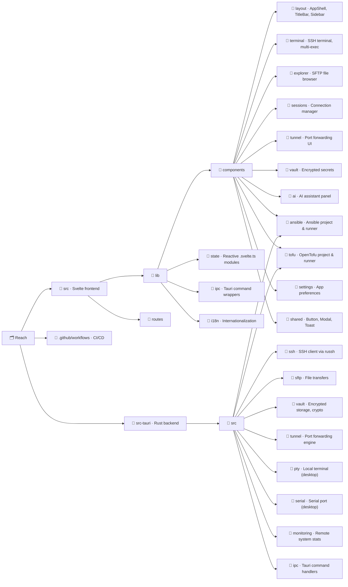

<p align="center">
  
</p>

<h1 align="center">Reach</h1>

<p align="center">
  A modern, cross-platform SSH client and remote management tool.<br>
  Built for engineers who got tired of PuTTY and wanted something that just works.
</p>

<p align="center">
  
  
  
</p>

<p align="center">
  <a href="https://alexandrosnt.github.io/Reach/"><strong>Documentation</strong></a> · <a href="https://github.com/alexandrosnt/Reach/releases">Download</a> · <a href="https://github.com/alexandrosnt/Reach/issues">Report a Bug</a>
</p>

---

<p align="center">
  
</p>

---

## Why Reach?

Most SSH tools feel like they were designed in 2005, because they were. MobaXterm is Windows-only and bloated, PuTTY hasn't changed in decades, and Termius wants a subscription for basic features.

Reach is what happens when you build an SSH client from scratch with a native UI, proper encryption, and the kind of workflow you'd actually want to use every day. No Electron. No monthly fee. Just a fast, clean tool that runs everywhere.

## What's inside

### Core

- **SSH Terminal** · Full interactive shell with WebGL rendering. Tabs, split views, and resize that actually works.
- **SFTP File Explorer** · Browse remote filesystems, drag-and-drop transfers, inline editing. Feels like a local file manager.
- **Session Manager** · Save connections with folders and tags. Credentials are encrypted at rest, not stored in plaintext configs.
- **Jump Host (ProxyJump)** · Connect through bastion servers with multi-hop SSH tunneling. Import hosts directly from `~/.ssh/config`.

### Productivity

- **Port Tunneling** · Local, remote, and dynamic SOCKS forwarding. Set it up once, save it with the session.
- **Multi-Exec** · Broadcast the same command to 10 servers at once. Handy for fleet updates.
- **System Monitoring** · Live CPU, memory, and disk stats from connected hosts without installing agents.

### Infrastructure as Code

- **Ansible** · Manage playbooks, inventories, roles, and collections. Run playbooks and ad-hoc commands with streaming output. Encrypts/decrypts files with ansible-vault. On Windows, automatically runs through WSL.
- **OpenTofu** · Plan, apply, and destroy infrastructure. Browse state, manage providers and modules. Full workspace with file editor and streaming command output.

### Extras

- **Serial Console** · Talk to routers, switches, and embedded devices over COM/TTY.
- **AI Assistant** · Optional AI integration for command suggestions and troubleshooting (bring your own API key).
- **Encrypted Vault** · Store secrets, credentials, and SSH keys in an encrypted vault with cloud sync support.
- **Lua Plugins** · Extend Reach with sandboxed Lua scripts. Access SSH, storage, and UI hooks through the host API.
- **Auto-Updates** · The app checks for updates on startup and periodically while running. No manual downloads.

## Tech

Reach is a [Tauri v2](https://v2.tauri.app) app with a Rust backend and Svelte 5 frontend. The entire SSH stack runs natively in Rust through [russh](https://github.com/warp-tech/russh), with no OpenSSH dependency. The UI is rendered in a system webview (not bundled Chromium), so the final binary is small and memory usage stays low.

| | |
|---|---|
| **Backend** | Rust, Tokio, russh |
| **Frontend** | Svelte 5, SvelteKit, TypeScript |
| **Styling** | Tailwind CSS v4 |
| **Terminal** | xterm.js with WebGL addon |
| **Crypto** | XChaCha20-Poly1305, Argon2id, X25519 |
| **Platforms** | Windows, macOS, Linux, Android |

## Getting started

Grab the latest release from the [Releases page](https://github.com/alexandrosnt/Reach/releases). Installers are available for Windows (NSIS), macOS (.dmg), Linux (.deb, .AppImage, .rpm), and Android (.apk).

## Building from source

You'll need [Rust](https://rustup.rs), [Node.js 22+](https://nodejs.org), and the [Tauri prerequisites](https://v2.tauri.app/start/prerequisites/) for your OS.

```bash
git clone https://github.com/alexandrosnt/Reach.git
cd Reach
npm install
npm run tauri dev
```

For a production build:

```bash
npm run tauri build
```

## Project structure



## Changelog

### v0.3.1
- **Fix editor window reopen** — Editor now hides instead of closing to avoid WebView2 crash on Windows; reopens instantly when editing another file
- **Fix editor initial load** — Files are delivered via Rust backend message queue instead of unreliable cross-window events
- **Editor tabs** — Multiple files open as tabs in a single editor window with dirty-state indicators
- **Close tab shortcut** — Changed from Ctrl+W to Ctrl+Shift+W to avoid browser conflicts
- Fixed corrupted i18n locale files, added `editor.opening` key to all 6 locales

### v0.3.0
- **Ansible integration** — Full Ansible UI with project management, playbook execution, inventory editor, roles/collections management, ad-hoc commands, and vault encrypt/decrypt
- **OpenTofu integration** — Infrastructure-as-Code workspace with project management, plan/apply/destroy, state inspection, and provider/module management
- **WSL auto-detection** — On Windows, Ansible commands automatically route through WSL with two-step status checks (WSL available + Ansible installed)
- **Toolchain installer** — One-click install for Ansible (via pip/pipx, or through WSL on Windows) and OpenTofu (direct binary download)
- Streaming command output with color-coded stdout/stderr for both Ansible and OpenTofu operations
- Vault-backed project storage — all IaC projects are encrypted at rest alongside sessions and credentials

### v0.2.3
- Fixed app failing to launch on Linux Wayland (Error 71 Protocol error) by disabling the WebKitGTK DMA-BUF renderer. Affects KDE Plasma, GNOME, Sway, especially with NVIDIA drivers.

### v0.2.2
- Fixed plugin button actions (e.g. Refresh) failing when calling async host API functions like `reach.ssh.exec()`
- Fixed plugin hooks not awaiting async Lua calls, causing `reach.ssh.exec()` to silently return errors
- Plugins now auto-load on app startup instead of requiring manual activation via Settings > Plugins
- Fixed SFTP upload/download completion hooks not awaiting async plugin dispatch

### v0.2.1
- Jump host (ProxyJump) support — connect through bastion servers with multi-hop SSH tunneling via russh direct-tcpip channels
- SSH config import — parse and import hosts from `~/.ssh/config` with automatic ProxyJump chain resolution (cross-platform)
- Lua plugin system (beta) — sandboxed Lua VMs with host API for SSH commands, storage, and UI hooks
- Session editor and Quick Connect now support jump host configuration with per-hop auth settings
- New Plugins tab in Settings for managing Lua plugins
- 19 new i18n keys across all 6 locales

### v0.2.0
- Fixed drag-and-drop file uploads stacking and freezing — uploads now run sequentially instead of flooding the SSH connection
- Fixed silent upload failures — errors now show a toast notification instead of being swallowed
- Added feedback when dragging files from browsers or apps that don't provide file paths
- Added copy button to every AI chat message (appears on hover)
- Updated docs and removed snippets page

### v0.1.9
- Updated app preloader to use the actual app icon

### v0.1.8
- Added Bulgarian language
- 6 languages supported now: English, German, French, Greek, Italian, Bulgarian

### v0.1.7
- Single-instance mode, reopening the app focuses the existing window instead of opening a new one
- Fixed the auto-updater so it actually generates update artifacts and signatures
- Fixed release workflow for all platforms

### v0.1.6
- Welcome wizard on first run with language selection and optional Turso cloud sync setup
- Added German, French, Greek and Italian translations
- Language selector in Settings > General
- Language picker with flag icons during setup

## Contributing

Contributions are welcome. Bug reports, feature ideas, and pull requests all help. If you're picking up a larger feature, open an issue first so we can talk about the approach.

## License
### Licensed under the MIT License.
This project is free software: you are allowed to use, modify, and redistribute it for personal, academic, or commercial purposes under the terms of the MIT license. See the [LICENSE](LICENSE) file for full details.
